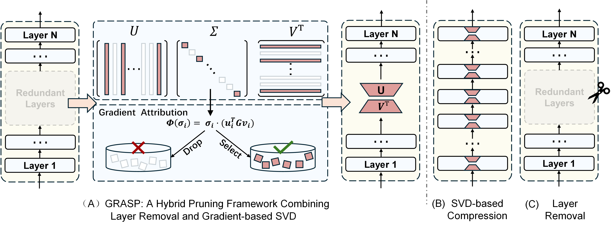

# GRASP: Gradient-based Retention of Adaptive Singular Parameters

**The official code for the paper** 📃 "[Rethinking Layer Removal: A Hybrid Pruning Framework Combining Layer Removal and Singular Value Selection for Efficient LLM Compression](https://arxiv.org/abs/2501.00339)".



# 🎯Quick Start

## Clone this repo

```sh
git clone https://github.com/LyoAI/GRASP.git
cd GRASP
```

## Install dependencies

```sh
# step 1: create a virtual environment
conda create -n grasp python=3.9

# step 2: activate the virtual environment
conda activate grasp

# step 3: install dependencies from requirements.txt
pip install -r requirements.txt
```

## Usage

1. **Adjust the parameters in `scripts/params_script.sh` to fit your needs.**

2. **Run the GRASP program:**

   ```bash
   bash scripts/run_grasp.sh
   ```

## Evaluation

**To evaluate the model, use the following script:**

```bash
bash scripts/run_evaluate.sh
```


# 📌Citation

**If you find the repository or paper helpful, please cite our work:**

```
@article{liu2024rethinking,
  title={Rethinking Layer Removal: Preserving Critical Components with Task-Aware Singular Value Decomposition},
  author={Liu, Kainan and Zhang, Yong and Cheng, Ning and Li, Zhitao and Wang, Shaojun and Xiao, Jing},
  journal={arXiv preprint arXiv:2501.00339},
  year={2024}
}
```